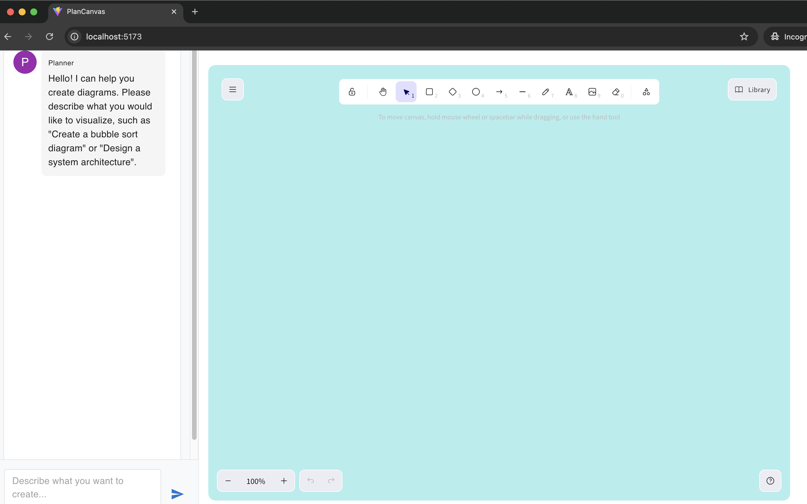

# PlanCanvas

PlanCanvas is an interactive diagram creation tool powered by AI that helps you visualize and design systems through natural language descriptions.



## Features

- 🎨 Interactive Excalidraw Canvas
- 💬 Natural Language Input
- 🤖 AI-Powered Diagram Generation
- 🔄 Real-time Updates
- 📱 Responsive Design

## Project Structure

```
PlanCanvas/
├── frontend/               # React TypeScript frontend
│   ├── src/
│   │   ├── components/    # React components
│   │   ├── services/      # API services
│   │   └── types/         # TypeScript types
│   └── package.json
│
└── backend/               # Python FastAPI backend
    ├── app/
    │   ├── agents/        # AI agents for diagram generation
    │   ├── core/          # Core business logic
    │   └── main.py        # FastAPI application
    └── requirements.txt
```

## Getting Started

### Prerequisites

- Node.js 16+
- Python 3.8+
- OpenAI API Key

### Frontend Setup

```bash
cd frontend
npm install
npm run dev
```

The frontend will be available at `http://localhost:5173`

### Backend Setup

```bash
cd backend
python -m venv venv
source venv/bin/activate  # On Windows: venv\Scripts\activate
pip install -r requirements.txt
python -m uvicorn app.main:app --reload
```

The backend API will be available at `http://localhost:8000`

## Environment Variables

### Frontend
Create a `.env` file in the frontend directory:
```
VITE_API_BASE_URL=http://localhost:8000
```

### Backend
Create a `.env` file in the backend directory:
```
OPENAI_API_KEY=your_api_key_here
```

## Contributing

1. Fork the repository
2. Create your feature branch (`git checkout -b feature/AmazingFeature`)
3. Commit your changes (`git commit -m 'Add some AmazingFeature'`)
4. Push to the branch (`git push origin feature/AmazingFeature`)
5. Open a Pull Request

## License

This project is licensed under the MIT License - see the [LICENSE](LICENSE) file for details. 